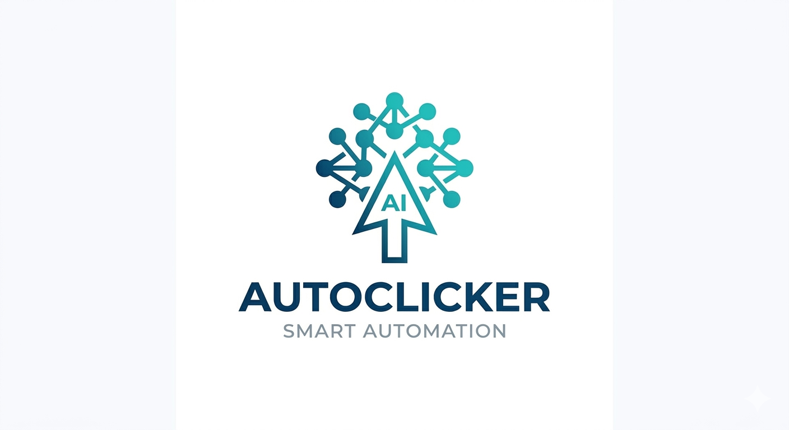

<p align="center">
  
</p>

# AutoClicker

<p align="center">
  <a href="README.md"><b>English</b></a> | <a href="README_CN.md">中文</a>
</p>

---

> IDE multi-session auto clicker — automatically click Run, Accept, Confirm buttons across VS Code, Cursor, Kiro, Antigravity and other IDEs.

## In One Sentence

Got N IDE windows running tasks, each needing a **Run** / **Accept** / **Continue** click every few minutes? AutoClicker watches your screen, spots the button, and clicks it — so you don't have to.

## Supported IDEs

| IDE | Run Button | Dialog Confirm | Tab Switching |
|-----|-----------|----------------|---------------|
| VS Code | ✅ | ✅ | ✅ |
| Cursor | ✅ | ✅ | ✅ |
| Kiro | ✅ | ✅ | ✅ |
| Antigravity | ✅ | ✅ | ✅ |
| Others (OCR) | ✅ | ✅ | ✅ |

## Two Detection Modes

**Mode 1: OCR Text Detection (Universal)**
Scans your screen for **Run / Accept / Continue / Yes / Confirm** button text. No prior screenshots needed.

```
Works out of the box — just brew install tesseract
```

**Mode 2: Image Template Matching (Precise)**
Screenshot buttons as templates. More accurate for fixed IDE layouts.

## Quick Start

### 1. Install Dependencies

```bash
# System dependency (OCR engine)
brew install tesseract

# Python dependencies
pip install -r requirements.txt
```

### 2. macOS Permissions (Required)

System Settings → Privacy & Security:
- **Accessibility** → allow Terminal / iTerm2
- **Screen Recording** → allow Terminal / iTerm2

### 3. Record Click Sequence

```bash
python clicker.py
# Choose 1 → Record mode
# Hold mouse on tab position for 5s → auto-captured
# Hold mouse on Run button center for 7s → auto-captured
# Repeat for N tabs
```

### 4. Start Auto-Clicking

```bash
python clicker.py
# Choose 3 → Start loop
# Switch to IDE window within 3s, then watch it click
```

Runtime controls:

| Action | How |
|--------|-----|
| Pause / Resume | Press `p` + Enter |
| Check status | Press `s` + Enter |
| Exit | Press `q` + Enter or Ctrl+C |
| Emergency stop | Move mouse to top-left corner |

## Language

```bash
python clicker.py --lang en     # English (--lang=en also works)
python clicker.py --lang zh     # 中文 (--lang=zh also works)
python clicker.py               # defaults to English
```

All three scripts (`clicker.py`, `auto_confirm.py`, `capture_template.py`) support `--lang`.

## How It Works

```
┌──────────────────────────────────────┐
│  Loop: Tab1 → Tab2 → Tab3 → Tab1...  │
│                                      │
│  ① Click tab                         │
│  ② OCR scan for Run button (up to 7s)│
│  ③ Found → click Run                 │
│  ④ Wait for task → next tab          │
│  ⑤ Not found → skip, next            │
└──────────────────────────────────────┘
```

## Configuration

Edit `click_sequence.json`:

```json
{
  "run_scan_timeout": 7,
  "run_scan_interval": 0.8,
  "after_run_delay": 3,
  "after_tab_delay": 1.0,
  "scan_width": 100,
  "scan_height": 36,
  "loop_delay": 2
}
```

| Param | Description | Default |
|-------|-------------|---------|
| `run_scan_timeout` | Max OCR scan time per tab (s) | 7 |
| `run_scan_interval` | Interval between scans (s) | 0.8 |
| `after_run_delay` | Wait after clicking Run (s) | 3 |
| `after_tab_delay` | Wait after clicking tab (s) | 1.0 |
| `scan_width` | Scan area width (px) | 100 |
| `scan_height` | Scan area height (px) | 36 |
| `loop_delay` | Extra wait between rounds (s) | 2 |

## Files

```
auto_confirm/
├── clicker.py              # Main: record + loop + OCR click
├── auto_confirm.py         # Auto-confirm: template + OCR scan
├── capture_template.py     # Template screenshot tool
├── requirements.txt        # Python deps
├── templates/              # Button template images
├── click_sequence.json     # Recorded click sequence config
├── README.md               # English docs
└── README_CN.md            # 中文文档
```

## Safety

- Mouse to top-left corner = emergency stop (PyAutoGUI FAILSAFE)
- Ctrl+C = graceful exit
- All clicks logged in `auto_confirm.log`

## Requirements

- macOS (primary; Windows/Linux need screenshot API adaptation)
- Python 3.9+
- Tesseract OCR
- Screen Recording + Accessibility permissions
